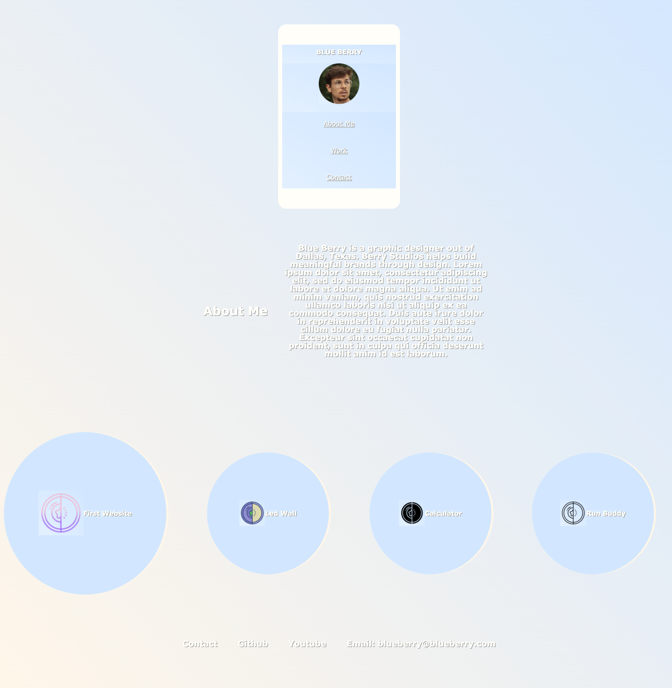

# Module-2-Challenge
# <Professional Profile>

## Description

The Professional Profile challenge provided me the opportunity to make the webpage sample for my future self; this project was completed after starting with no code. Codes structures and elements both in CSS and HTML were added to make a profile as aesthetically pleasing as possible with a begginer experience.

Many/most of the changes were made in the css.style file. Some div elements (non-descriptive) were change to semantic elements (descriptive). A header, nav element and footer were added along with alt attributes. Colors and shapes were altered to form a suitable profile

Changes were made in the CSS code so that the HTML flow followed the CSS, in turn, the code overall was easier to read horizontally. 

## Installation
1. A short wireframe idea was converted to block in HTML to start the webpage.
2. Alt attributes were added in HTML images and icons to aid those with disabilities.
3. Header, footer, and nav were added in place of div to ensure a better outline of the HTML.
4. Some class elements were altered between the CSS and HTML as well as descriptions added to both to make them easier to follow.
5. Media queries were added to change the layout of the webpage depending on electronic device.
6. Links were added so that once click they would follow a paths to the desired destination on the page.
7. Images attach to link to a website. All the links were changed to the same website since I do not have much of a portfolio at the moment.
8. The image of the first application was changed in size to detail that it was the first application.

## Screenshot

## Usage

Webpage:

 [Github Page Address](https://github.com/delacruzjonathan/Module-2-Challenge)
